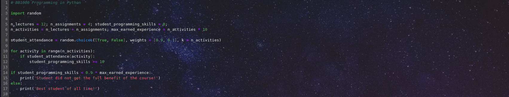

# BB1000



<h2>Welcome to the course Programming in Python!</h2>
<p>This course is an introductory course in programming based on the Python programming language. It is aimed at students in scientific and technical fields and no previous experience in programming is assumed. During the course, you will be exposed to various topics starting from the very basics and extending into more advanced areas and tools. The programming skills taught in the lectures will be put to use through exercises related to chemistry and biotechnology. We hope that you, by the end of this course, will have software skills that will make you work more effectively in your own field of study.</p>
<p>In this course you will meet</p>
<ul>
    <li><a class="inline_disabled" href="https://www.kth.se/profile/johvan" target="_blank" rel="noopener">Josefine H. Andersen</a>&nbsp;(teacher)</li>
    <li><a class="inline_disabled" href="https://www.kth.se/profile/panor" target="_blank" rel="noopener">Patrick Norman</a>&nbsp;(teacher)</li>
</ul>
<ul>
    <li><a class="inline_disabled" href="https://www.kth.se/profile/kimberg" target="_blank" rel="noopener">Victor Kimberg</a>&nbsp;(teacher)</li>
    <li><a class="inline_disabled" href="https://www.kth.se/profile/rinkevic" target="_blank" rel="noopener">Zilvinas Rinkevicius</a>&nbsp;(teacher)</li>
    <li><a class="inline_disabled" href="https://www.kth.se/profile/ahlqui" target="_blank" rel="noopener">M&aring;rten Ahlquist</a>&nbsp;(teacher)</li>
    <li>Bastiaan van Hoorn (teacher)</li>
    <li><a class="inline_disabled" href="https://www.kth.se/profile/linares" target="_blank" rel="noopener">Mathieu Linares</a> (teacher)</li>
    <li><a class="inline_disabled" href="https://www.kth.se/profile/vahtras" target="_blank" rel="noopener">Olav Vahtras</a> (course responsible)</li>
    <li>Erika Sandell (assistant)</li>
</ul>
<h3>General information</h3>
<p>A schedule for the course is provided at the bottom of this page and in the <a title="Syllabus" href="https://canvas.kth.se/courses/44826/assignments/syllabus">Syllabus</a>, where you will also find the course's intended learning outcomes.</p>
<p><span lang="en">There will be 12 lectures. </span>All lectures take place in <strong>U1, Brinellv&auml;gen 26</strong> and will be streamed via Zoom (<a class="inline_disabled" title="Link" href="https://kth-se.zoom.us/j/61898019911" target="_blank" rel="noopener">https://kth-se.zoom.us/j/61898019911</a>). To accommodate the large number of students, there will be an <strong>additional room </strong>booked for the lectures; you find the details in the schedule below.</p>
<p><span lang="en">There are two larger assignments due during the course, with three lab sessions scheduled for each.&nbsp; </span></p>
<p class="tw-data-text tw-text-large XcVN5d tw-ta" dir="ltr" data-placeholder="Translation"><span lang="en">The lectures, homework, and assignments are based on the use of Jupyter notebooks and will involve plenty of hands-on exercises. Course material will be published on Canvas during the course period. </span><span lang="en">You can find published information and content for the course activities in <a title="Modules" href="https://canvas.kth.se/courses/44826/modules" data-course-type="navigation" data-api-endpoint="https://canvas.kth.se/api/v1/courses/44826/modules" data-api-returntype="[Module]">Modules</a>. You must bring your own laptop to every course activity.</span><strong></strong></p>
<h3 class="tw-data-text tw-text-large XcVN5d tw-ta" dir="ltr" data-placeholder="Translation">Issues</h3>
<ul>
    <li aria-level="1"><strong>Text editors</strong>
        <ul>
            <li aria-level="2"><span>The MacOS </span><span>Terminal</span><span> program does not give the option to save files in text format. </span><span><br /></span><span style="color: #e03e2d;"><strong>Solution</strong></span><span>: Enter into the application preferences (keyboard shortcut </span><strong>CMD-,</strong><span>) and change settings so that Terminal works with unformatted text files.</span></li>
        </ul>
    </li>
    <li aria-level="1"><strong>Terminals</strong>
        <ul>
            <li aria-level="2"><span>The Anaconda Powershell does not start in the user home directory but instead a system directory. This has no known issues but is very inconvenient.<br /></span><span style="color: #e03e2d;"><strong>Solution</strong></span><span>: Navigate your way to your home directory with use of the <span style="color: #236fa1;">cd</span> command.</span></li>
            <li aria-level="2"><span>The JupyterLab interface does not open in the browser.</span><span><br /></span><span style="color: #e03e2d;"><strong>Solution</strong></span><span>: Copy the URL link printed when starting </span><span>jupyter-lab</span><span> from the terminal window into the browser navigation bar.</span></li>
        </ul>
    </li>
    <li aria-level="1"><strong>Conda installations</strong>
        <ul>
            <li aria-level="2"><span>Conda does not support tablets (iPads and others).</span></li>
            <li aria-level="2"><span>Conda does not support MacOS 10.x and older versions. </span><span><br /></span><span style="color: #e03e2d;"><strong>Solution</strong></span><span>: Update the operating system. It is in general a good habit to keep the operating system up to date.</span></li>
            <li aria-level="2">We have seen problems with installations on Macs with Intel processors: the installation appears to look fine, &nbsp;Python works but Jupyter Lab crashes with segmentation fault or something similar. <br /><strong><span style="color: #e03e2d;">Solution:</span></strong> install Python from official sources at <a href="https://python.org," target="_blank" rel="noopener">https://python.org,</a> see <a title="Alternative installation of Python" href="https://canvas.kth.se/courses/44826/pages/alternative-installation-of-python" data-course-type="wikiPages" data-published="true" data-api-endpoint="https://canvas.kth.se/api/v1/courses/44826/pages/alternative-installation-of-python" data-api-returntype="Page">Alternative installation of Python</a></li>
            <li aria-level="2">On Windows 11, Jupyter-lab does not run even though <span>conda </span><span>and </span><span>Python</span><span> worked fine. Indications of permission issues were given. The underlying problem was an aggressive antivirus software.<br /></span><span style="color: #e03e2d;"><strong>Solution</strong></span><span>: Command the antivirus software to allow running JupyterLab.</span></li>
        </ul>
    </li>
    <li><strong>Canvas</strong>
        <ul>
            <li>On MacOS, downloading a text file (*.txt) &nbsp;from Canvas results in a file with name true.txt and content "Unauthorized". The workaround is that we teachers will provide it as an archive file (*.zip) which you can download and unpack on the command line with "unzip filename.zip"</li>
        </ul>
    </li>
</ul>
<h3>Assignments</h3>
<p><span lang="en">Under <a title="Assignments" href="https://canvas.kth.se/courses/37545/assignments" data-api-endpoint="https://canvas.kth.se/api/v1/courses/37545/assignments" data-api-returntype="[Assignment]">Assignments</a>, you will find all submissions that are due during the course. Note that you might find assignments in the modules; it's the same assignment, just linked to from the module.</span></p>
<h3>Exam and grading</h3>
<p>The homework and lab exercises are mandatory ingredients in the course. The deadline for homework is generally before the next lecture.</p>
<p>The grading (A-E) will be based on a final exam scheduled for March 15, 8-12. Funka students have extended exam time. It will take place in a class room with your own laptops (power outlets will be provided). The exam is digital in the form of Jupyter notebooks, similar to what you will see in the homework. You will be able to use the internet (Google, course material) except for communication tools (mail, social media) and AI-tools.</p>
<h3>Communication</h3>
<p>You can find all announcements posted via <a title="Announcements" href="https://canvas.kth.se/courses/44826/announcements">Announcements</a>.<strong></strong></p>
<h2>Schedule</h2>
<table style="border-collapse: collapse; width: 97.8887%; height: 780px; border-color: #000000; border-style: dotted;" border="1">
    <tbody>
        <tr style="height: 29px; border-style: none; background-color: #ced4d9;">
            <td style="width: 9.9902%; height: 29px; border-style: none;"><strong>Date</strong></td>
            <td style="width: 9.9902%; height: 29px; border-style: none;"><strong>Time</strong></td>
            <td style="width: 8.85816%; height: 29px; border-style: none;"><strong>Activity</strong></td>
            <td style="width: 38.1463%; height: 29px; border-style: none;"><strong>Content</strong></td>
            <td style="width: 9.23854%; border-style: none; height: 29px;"><strong>Extra room<br /></strong></td>
            <td style="width: 3.69829%; height: 29px; border-style: none;"><strong>Teacher</strong></td>
        </tr>
        <tr style="height: 29px; border-style: none;">
            <td style="width: 9.9902%; height: 29px; border-style: none;"><strong>Week 3</strong></td>
            <td style="width: 9.9902%; height: 29px; border-style: none;"></td>
            <td style="width: 8.85816%; height: 29px; border-style: none;"></td>
            <td style="width: 38.1463%; height: 29px; border-style: none;"></td>
            <td style="width: 9.23854%; border-style: none; background-color: #ecf0f1; height: 29px;"></td>
            <td style="width: 3.69829%; height: 29px; border-style: none;"></td>
        </tr>
        <tr style="height: 29px; border-style: none;">
            <td style="width: 9.9902%; height: 29px; border-style: none;">Thur (18/1)</td>
            <td style="width: 9.9902%; height: 29px; border-style: none;">10-12 (2h)</td>
            <td style="width: 8.85816%; height: 29px; border-style: none;">Lecture</td>
            <td style="width: 38.1463%; height: 29px; border-style: none;">Introduction to Python in Biotechnology</td>
            <td style="width: 9.23854%; border-style: none; background-color: #ecf0f1; height: 29px;">U61</td>
            <td style="width: 3.69829%; height: 29px; border-style: none;">PN</td>
        </tr>
        <tr style="height: 29px; border-style: none;">
            <td style="width: 9.9902%; height: 29px; border-style: none;">Fri (19/1)</td>
            <td style="width: 9.9902%; height: 29px; border-style: none;">13-15 (2h)</td>
            <td style="width: 8.85816%; height: 29px; border-style: none;">Lecture</td>
            <td style="width: 38.1463%; height: 29px; border-style: none;">Computers, file systems, terminals</td>
            <td style="width: 9.23854%; border-style: none; background-color: #ecf0f1; height: 29px;">(open areas)</td>
            <td style="width: 3.69829%; height: 29px; border-style: none;">PN</td>
        </tr>
        <tr style="height: 29px; border-style: none;">
            <td style="width: 9.9902%; height: 29px; border-style: none;"><strong>Week 4</strong></td>
            <td style="width: 9.9902%; height: 29px; border-style: none;"></td>
            <td style="width: 8.85816%; height: 29px; border-style: none;"></td>
            <td style="width: 38.1463%; height: 29px; border-style: none;"></td>
            <td style="width: 9.23854%; border-style: none; background-color: #ecf0f1; height: 29px;"></td>
            <td style="width: 3.69829%; height: 29px; border-style: none;"></td>
        </tr>
        <tr style="height: 29px; border-style: none;">
            <td style="width: 9.9902%; height: 29px; border-style: none;">Mon (22/1)</td>
            <td style="width: 9.9902%; height: 29px; border-style: none;">13-15 (2h)</td>
            <td style="width: 8.85816%; height: 29px; border-style: none;">Lecture</td>
            <td style="width: 38.1463%; height: 29px; border-style: none;">Jupyter notebooks</td>
            <td style="width: 9.23854%; border-style: none; background-color: #ecf0f1; height: 29px;">U51</td>
            <td style="width: 3.69829%; height: 29px; border-style: none;">VK</td>
        </tr>
        <tr style="height: 29px; border-style: none;">
            <td style="width: 9.9902%; height: 29px; border-style: none;">Wed (24/1)</td>
            <td style="width: 9.9902%; height: 29px; border-style: none;">10-12 (2h)</td>
            <td style="width: 8.85816%; height: 29px; border-style: none;">Lecture</td>
            <td style="width: 38.1463%; height: 29px; border-style: none;">Datatypes, branching, iterations</td>
            <td style="width: 9.23854%; border-style: none; background-color: #ecf0f1; height: 29px;">U31</td>
            <td style="width: 3.69829%; height: 29px; border-style: none;">VK</td>
        </tr>
        <tr style="height: 29px; border-style: none;">
            <td style="width: 9.9902%; height: 29px; border-style: none;"><strong>Week 5</strong></td>
            <td style="width: 9.9902%; height: 29px; border-style: none;"></td>
            <td style="width: 8.85816%; height: 29px; border-style: none;"></td>
            <td style="width: 38.1463%; height: 29px; border-style: none;"></td>
            <td style="width: 9.23854%; border-style: none; background-color: #ecf0f1; height: 29px;"></td>
            <td style="width: 3.69829%; height: 29px; border-style: none;"></td>
        </tr>
        <tr style="height: 29px; border-style: none;">
            <td style="width: 9.9902%; height: 29px; border-style: none;">Mon (29/1)</td>
            <td style="width: 9.9902%; height: 29px; border-style: none;">15-17 (2h)</td>
            <td style="width: 8.85816%; height: 29px; border-style: none;">Lecture</td>
            <td style="width: 38.1463%; height: 29px; border-style: none;">Debugging</td>
            <td style="width: 9.23854%; border-style: none; background-color: #ecf0f1; height: 29px;">U51</td>
            <td style="width: 3.69829%; height: 29px; border-style: none;">JHA</td>
        </tr>
        <tr style="height: 29px; border-style: none;">
            <td style="width: 9.9902%; height: 29px; border-style: none;">Thur (1/2)</td>
            <td style="width: 9.9902%; height: 29px; border-style: none;">13-15 (2h)</td>
            <td style="width: 8.85816%; height: 29px; border-style: none;">Lecture</td>
            <td style="width: 38.1463%; height: 29px; border-style: none;">Pandas, I/O</td>
            <td style="width: 9.23854%; border-style: none; background-color: #ecf0f1; height: 29px;">(open areas)</td>
            <td style="width: 3.69829%; height: 29px; border-style: none;">JHA</td>
        </tr>
        <tr style="height: 29px; border-style: none;">
            <td style="width: 9.9902%; height: 29px; border-style: none;"><strong>Week 6</strong></td>
            <td style="width: 9.9902%; height: 29px; border-style: none;"></td>
            <td style="width: 8.85816%; height: 29px; border-style: none;"></td>
            <td style="width: 38.1463%; height: 29px; border-style: none;"></td>
            <td style="width: 9.23854%; border-style: none; background-color: #ecf0f1; height: 29px;"></td>
            <td style="width: 3.69829%; height: 29px; border-style: none;"></td>
        </tr>
        <tr style="height: 29px; border-style: none;">
            <td style="width: 9.9902%; height: 29px; border-style: none;">Mon (5/2)</td>
            <td style="width: 9.9902%; height: 29px; border-style: none;">10-12 (2h)</td>
            <td style="width: 8.85816%; height: 29px; border-style: none;">Lecture</td>
            <td style="width: 38.1463%; height: 29px; border-style: none;">Visualization</td>
            <td style="width: 9.23854%; border-style: none; background-color: #ecf0f1; height: 29px;">U61</td>
            <td style="width: 3.69829%; height: 29px; border-style: none;">JHA</td>
        </tr>
        <tr style="height: 29px; border-style: none;">
            <td style="width: 9.9902%; height: 29px; border-style: none;">Fri (9/2)</td>
            <td style="width: 9.9902%; height: 29px; border-style: none;">13-15 (2h)</td>
            <td style="width: 8.85816%; height: 29px; border-style: none;">Lecture</td>
            <td style="width: 38.1463%; height: 29px; border-style: none;">Functions and classes, object-oriented programming</td>
            <td style="width: 9.23854%; border-style: none; background-color: #ecf0f1; height: 29px;">(open areas)</td>
            <td style="width: 3.69829%; height: 29px; border-style: none;">ZR</td>
        </tr>
        <tr style="height: 29px; border-style: none;">
            <td style="width: 9.9902%; height: 29px; border-style: none;"><strong>Week 7</strong></td>
            <td style="width: 9.9902%; height: 29px; border-style: none;"></td>
            <td style="width: 8.85816%; height: 29px; border-style: none;"></td>
            <td style="width: 38.1463%; height: 29px; border-style: none;"></td>
            <td style="width: 9.23854%; border-style: none; background-color: #ecf0f1; height: 29px;"></td>
            <td style="width: 3.69829%; height: 29px; border-style: none;"></td>
        </tr>
        <tr style="height: 29px; border-style: none;">
            <td style="width: 9.9902%; height: 29px; border-style: none;">Mon (12/2)</td>
            <td style="width: 9.9902%; height: 29px; border-style: none;">13-15 (2h)</td>
            <td style="width: 8.85816%; height: 29px; border-style: none;">Lecture</td>
            <td style="width: 38.1463%; height: 29px; border-style: none;">Good practices, style and formatting</td>
            <td style="width: 9.23854%; border-style: none; background-color: #ecf0f1; height: 29px;">U61</td>
            <td style="width: 3.69829%; height: 29px; border-style: none;">ZR</td>
        </tr>
        <tr style="height: 29px; border-style: none;">
            <td style="width: 9.9902%; height: 29px; border-style: none;">Tue (13/2)</td>
            <td style="width: 9.9902%; height: 29px; border-style: none;">13-15 (2h)</td>
            <td style="width: 8.85816%; height: 29px; border-style: none;">Lab</td>
            <td style="width: 38.1463%; height: 29px; border-style: none;">Bioinformatics part 1</td>
            <td style="width: 9.23854%; border-style: none; background-color: #ecf0f1; height: 29px;">(open areas)</td>
            <td style="width: 3.69829%; height: 29px; border-style: none;">ML+MA</td>
        </tr>
        <tr style="height: 28px;">
            <td style="width: 9.9902%; border-style: none; height: 28px;">Fri (16/2)</td>
            <td style="width: 9.9902%; border-style: none; height: 28px;">15-17</td>
            <td style="width: 8.85816%; border-style: none; height: 28px;">Lab</td>
            <td style="width: 38.1463%; border-style: none; height: 28px;">Bioinformatics part 2</td>
            <td style="width: 9.23854%; border-style: none; background-color: #ecf0f1; height: 28px;">(open areas)</td>
            <td style="width: 3.69829%; border-style: none; height: 28px;">ML+MA</td>
        </tr>
        <tr style="height: 29px; border-style: none;">
            <td style="width: 9.9902%; height: 29px; border-style: none;"><strong>Week 8</strong></td>
            <td style="width: 9.9902%; height: 29px; border-style: none;"></td>
            <td style="width: 8.85816%; height: 29px; border-style: none;"></td>
            <td style="width: 38.1463%; height: 29px; border-style: none;"></td>
            <td style="width: 9.23854%; border-style: none; background-color: #ecf0f1; height: 29px;"></td>
            <td style="width: 3.69829%; height: 29px; border-style: none;"></td>
        </tr>
        <tr style="height: 28px;">
            <td style="width: 9.9902%; border-style: none; height: 28px;">Mon (19/2)</td>
            <td style="width: 9.9902%; border-style: none; height: 28px;">13-15 (2h)</td>
            <td style="width: 8.85816%; border-style: none; height: 28px;">Lab</td>
            <td style="width: 38.1463%; border-style: none; height: 28px;">Bioinformatics part 3</td>
            <td style="width: 9.23854%; border-style: none; background-color: #ecf0f1; height: 28px;"></td>
            <td style="width: 3.69829%; border-style: none; height: 28px;">ML+MA</td>
        </tr>
        <tr style="height: 28px;">
            <td style="width: 9.9902%; border-style: none; height: 28px;">Wed (21/2)</td>
            <td style="width: 9.9902%; border-style: none; height: 28px;">13-15 (2h)</td>
            <td style="width: 8.85816%; border-style: none; height: 28px;">Lab</td>
            <td style="width: 38.1463%; border-style: none; height: 28px;">Data analysis part 1</td>
            <td style="width: 9.23854%; border-style: none; background-color: #ecf0f1; height: 28px;"></td>
            <td style="width: 3.69829%; border-style: none; height: 28px;">MA+JHA</td>
        </tr>
        <tr style="height: 29px; border-style: none;">
            <td style="width: 9.9902%; height: 29px; border-style: none;">Fri (23/2)</td>
            <td style="width: 9.9902%; height: 29px; border-style: none;">13-15 (2h)</td>
            <td style="width: 8.85816%; height: 29px; border-style: none;">Lecture</td>
            <td style="width: 38.1463%; height: 29px; border-style: none;">Recap: variables and scope. Command-line Python</td>
            <td style="width: 9.23854%; border-style: none; background-color: #ecf0f1; height: 29px;">U51</td>
            <td style="width: 3.69829%; height: 29px; border-style: none;">OV</td>
        </tr>
        <tr style="height: 29px; border-style: none;">
            <td style="width: 9.9902%; height: 29px; border-style: none;"><strong>Week 9</strong></td>
            <td style="width: 9.9902%; height: 29px; border-style: none;"></td>
            <td style="width: 8.85816%; height: 29px; border-style: none;"></td>
            <td style="width: 38.1463%; height: 29px; border-style: none;"></td>
            <td style="width: 9.23854%; border-style: none; background-color: #ecf0f1; height: 29px;"></td>
            <td style="width: 3.69829%; height: 29px; border-style: none;"></td>
        </tr>
        <tr style="height: 29px; border-style: none;">
            <td style="width: 9.9902%; height: 29px; border-style: none;">Mon (26/2)</td>
            <td style="width: 9.9902%; height: 29px; border-style: none;">13-15 (2h)</td>
            <td style="width: 8.85816%; height: 29px; border-style: none;">Lab</td>
            <td style="width: 38.1463%; height: 29px; border-style: none;">Data analysis part 2</td>
            <td style="width: 9.23854%; border-style: none; background-color: #ecf0f1; height: 29px;">U61</td>
            <td style="width: 3.69829%; height: 29px; border-style: none;">MA+JHA</td>
        </tr>
        <tr style="height: 29px; border-style: none;">
            <td style="width: 9.9902%; height: 29px; border-style: none;">Fri (1/3)</td>
            <td style="width: 9.9902%; height: 29px; border-style: none;">13-15 (2h)</td>
            <td style="width: 8.85816%; height: 29px; border-style: none;">Lecture</td>
            <td style="width: 38.1463%; height: 29px; border-style: none;">Python modules for biotechnology</td>
            <td style="width: 9.23854%; border-style: none; background-color: #ecf0f1; height: 29px;">U41</td>
            <td style="width: 3.69829%; height: 29px; border-style: none;">MA</td>
        </tr>
        <tr style="height: 29px; border-style: none;">
            <td style="width: 9.9902%; height: 29px; border-style: none;"><strong>Week 10</strong></td>
            <td style="width: 9.9902%; height: 29px; border-style: none;"></td>
            <td style="width: 8.85816%; height: 29px; border-style: none;"></td>
            <td style="width: 38.1463%; height: 29px; border-style: none;"></td>
            <td style="width: 9.23854%; border-style: none; background-color: #ecf0f1; height: 29px;"></td>
            <td style="width: 3.69829%; height: 29px; border-style: none;"></td>
        </tr>
        <tr style="height: 29px; border-style: none;">
            <td style="width: 9.9902%; height: 29px; border-style: none;">Mon (4/3)</td>
            <td style="width: 9.9902%; height: 29px; border-style: none;">10-12 (2h)</td>
            <td style="width: 8.85816%; height: 29px; border-style: none;">Lab</td>
            <td style="width: 38.1463%; height: 29px; border-style: none;">Data analysis part 3</td>
            <td style="width: 9.23854%; border-style: none; background-color: #ecf0f1; height: 29px;">(open areas)</td>
            <td style="width: 3.69829%; height: 29px; border-style: none;">MA+JHA</td>
        </tr>
        <tr style="height: 29px; border-style: none;">
            <td style="width: 9.9902%; height: 29px; border-style: none;">Mon (4/3)</td>
            <td style="width: 9.9902%; height: 29px; border-style: none;">13-15 (2h)</td>
            <td style="width: 8.85816%; height: 29px; border-style: none;">Lecture</td>
            <td style="width: 38.1463%; height: 29px; border-style: none;">AI tools for programming</td>
            <td style="width: 9.23854%; border-style: none; background-color: #ecf0f1; height: 29px;">U61</td>
            <td style="width: 3.69829%; height: 29px; border-style: none;">BvH</td>
        </tr>
    </tbody>
</table>
<p>&nbsp;</p>

```{tableofcontents}
```
